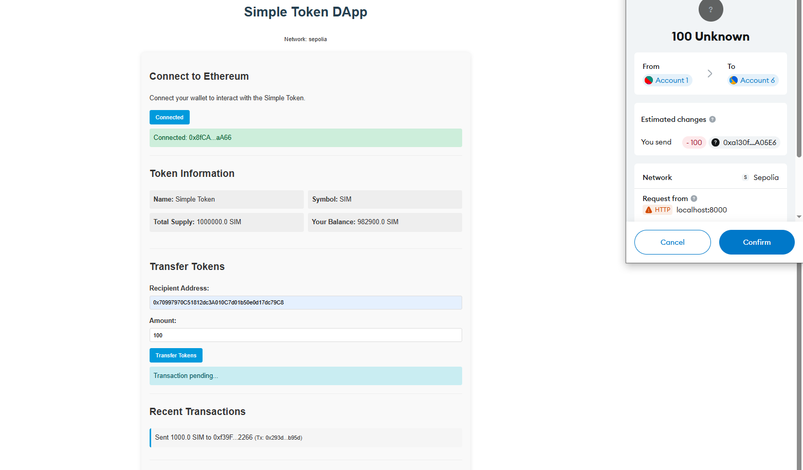

# Simple Token DApp Documentation

## Etherscan Verification

[Etherscan Verification](https://sepolia.etherscan.io/address/0xa130fDe57A31694DBC13d0fd920382bDf60A05E6#code)

## Overview

This decentralized application (DApp) implements a standard ERC-20 token on the Ethereum blockchain with functionality to transfer tokens between accounts. The DApp consists of:

1. A Solidity smart contract for the ERC-20 token
2. Deployment scripts for various Ethereum networks
3. A web-based frontend for interacting with the token
4. Comprehensive test suite to ensure functionality

## Repository

**GitHub Repository**: [https://github.com/SundayOlubode/crypto_dApp.git](https://github.com/SundayOlubode/crypto_dApp.git)

## Project Structure

```
simple-token-dapp/
├── contracts/
│   └── SimpleToken.sol        # ERC-20 token implementation
├── scripts/
│   └── deploy.js              # Deployment script
├── test/
│   └── SimpleToken.test.js    # Test cases
├── frontend/
│   └── index.html             # Web interface
├── hardhat.config.js          # Hardhat configuration
├── .env.example               # Environment variables template
└── README.md                  # Project documentation
```

## Prerequisites

- [Node.js](https://nodejs.org/) (v14+ recommended)
- [npm](https://www.npmjs.com/) or [yarn](https://yarnpkg.com/)
- [MetaMask](https://metamask.io/) browser extension
- Ethereum testnet account with test ETH ([Sepolia](https://ethereum.org/en/developers/docs/networks/#testnets) recommended)
- [Alchemy](https://www.alchemy.com/) or [Infura](https://infura.io/) account for testnet access

## Setup and Installation

### 1. Clone the Repository

```bash
git clone https://github.com/SundayOlubode/crypto_dApp.git
cd crypto_dApp
```

### 2. Install Dependencies

```bash
npm install
```

### 3. Set Up Environment Variables

Create a `.env` file from the template:

```bash
cp .env.example .env
```

Edit the `.env` file and add your private keys and API endpoints:

```
# Your Ethereum wallet private key (without 0x prefix)
PRIVATE_KEY=your_private_key_here

# Sepolia testnet RPC URL from Alchemy or Infura
SEPOLIA_RPC_URL=https://eth-sepolia.g.alchemy.com/v2/your-api-key

# Etherscan API key for contract verification
ETHERSCAN_API_KEY=your_etherscan_api_key
```

⚠️ **Security Warning**: Never commit your `.env` file to version control!

## Compiling the Smart Contract

Compile the Solidity smart contract:

```bash
npx hardhat compile
```

This will generate the ABI and other artifacts in the `artifacts/` directory.

## Testing

Run the test suite to verify the smart contract's functionality:

```bash
npx hardhat test
```

Expected output:

```
SimpleToken
  Deployment
    ✓ Should set the right owner
    ✓ Should assign the total supply of tokens to the owner
  Transactions
    ✓ Should transfer tokens between accounts
    ✓ Should fail if sender doesn't have enough tokens
    ✓ Should update balances after transfers

5 passing (1.52s)
```

### Test Coverage

The tests verify:

- Proper token initialization (name, symbol, decimals, total supply)
- Token transfers between accounts
- Balance updates after transfers
- Authorization checks (insufficient balance handling)
- Proper event emissions

## Deployment

### Local Development Network

Start a local Hardhat node in one terminal:

```bash
npx hardhat node
```

Deploy to the local network in another terminal:

```bash
npx hardhat run scripts/deploy.js --network localhost
```

### Testnet Deployment (Sepolia)

Deploy to the Sepolia testnet:

```bash
npx hardhat run scripts/deploy.js --network sepolia
```

Expected output:

```
Deploying SimpleToken contract...
SimpleToken deployed to: 0x...  # Your contract address will appear here
Token details:
  Name: Simple Token
  Symbol: SIM
  Decimals: 18
  Total Supply: 1000000.0
Deployment transaction: 0x...
Waiting for block confirmations...
Verifying contract on Etherscan...
Contract verified on Etherscan!
```

**Important**: Save the contract address from the output, as you'll need it to interact with your DApp.

### Post-Deployment Verification

After deployment, you should:

1. **Save the contract address** displayed in the terminal
2. Verify your contract on [Etherscan](https://sepolia.etherscan.io/) (automatic if using the deployment script)
3. Confirm the contract's state (token name, symbol, supply, etc.)

## Running the Frontend

### 1. Serve the Frontend

The frontend can be served using any standard web server. For development, you can use:

```bash
# Python HTTP server
python -m http.server 8000

# OR with Node.js
npx http-server
```

Then access http://localhost:8000 or http://localhost:8080 in your browser.

### 2. Connect to the DApp

1. Open the frontend in your browser
2. When prompted, enter the deployed contract address or continue with the existing one
3. Connect your MetaMask wallet by clicking "Connect Wallet"
4. Confirm the connection in the MetaMask popup

### 3. Using the DApp

After connecting:

1. View token information including:

   - Token name
   - Token symbol
   - Total supply
   - Your balance

2. Transfer tokens:

   - Enter a recipient address
   - Enter the amount to transfer
   - Click "Transfer Tokens"
   - Confirm the transaction in MetaMask

3. View transaction history:
   - The DApp will display your recent transfer activity

## Screenshots

### Frontend Interface

[DApp Frontend Interface](image.png)


## How It Works

### Smart Contract

The SimpleToken contract is a standard ERC-20 implementation with the following key features:

1. **Token Metadata**: Name, symbol, decimals, and total supply parameters
2. **Balances**: Mapping of addresses to token balances
3. **Allowances**: Mapping for delegated token spending permissions
4. **Transfer Functions**: Methods to move tokens between addresses
5. **Events**: Notifications for transfers and approvals

### Frontend

The frontend provides a user-friendly interface for:

1. **Connecting Wallets**: Integration with MetaMask for account access
2. **Viewing Token Info**: Display of token metadata and balances
3. **Transferring Tokens**: UI for executing token transfers
4. **Transaction History**: Record of past transfer activity

### Interaction Flow

1. The user connects their wallet to the DApp
2. The DApp loads token information from the smart contract
3. When a transfer is initiated, the DApp:
   - Creates the transaction
   - Sends it to the network via MetaMask
   - Waits for confirmation
   - Updates the UI with the new balance and transaction record

## Troubleshooting

### MetaMask Detection Issues

If MetaMask is not being detected:

1. Ensure you're not opening the HTML file directly (use a web server)
2. Verify MetaMask is installed and unlocked

### Transaction Failures

If transactions are failing:

1. Ensure you have enough ETH for gas fees
2. Check that you have sufficient token balance
3. Verify the recipient address is valid
4. Look for specific error messages in the DApp UI
